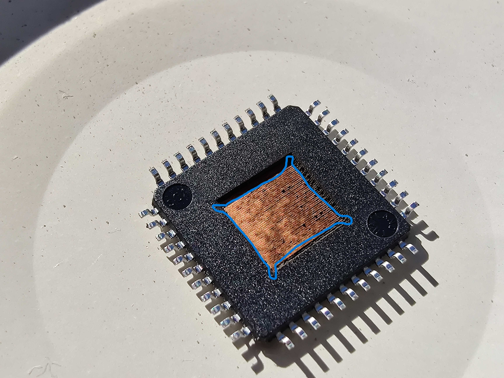

# Rig settings

- Power: 80% duty
- Vertical hop: 5
- Horizontal hop: 20
- Dimensions: 4.5mm x 4.5mm 
- Passes: 6 passes to get to the die pad, some of the attempts have required one extra pass to get die pad cleanly visible

# Notes for die pad removal

Cut at least two of the corners of the die pad by pressing them with an edge of sharp knife. Do not apply a lot of force, the copper is very thin. Use an edge of a knife or a sharpened flat head screw driver to carefully peel the die pad up from the middle. Work one edge entirely and then bend the die pad off. Should be fairly easy to do without a lot of pressure.

If the die pad doesn't lift off, make one more pass with the laser.

There is plenty of material on the underside of the chip so even if you are a bit careless with the laser you should have any issues hitting anything critical like the bond wires.

