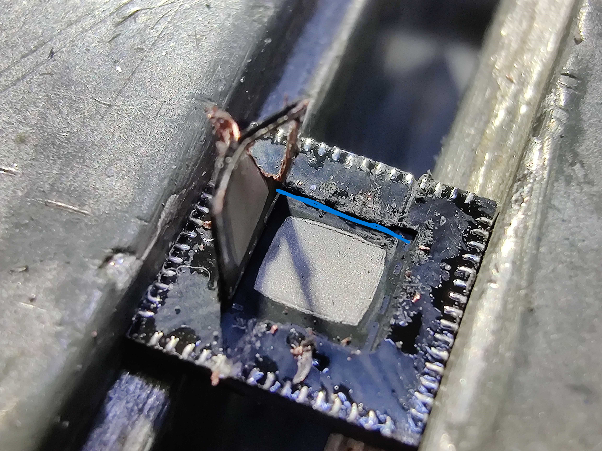

# Rig settings

No need for laser on this one!

# Notes for die pad removal

The die pad is the same as the large ground pad on the bottom of the chip. Use a sharp thin knife and carefully press the knife into the area where the epoxy and ground pad meets. Work your way through a whole side and then use a sharpened flat head screwdriver to carefully peel the pad off. It should come off pretty easily. 

The bottom of the chip is pretty robust. There shouldn't be any issues for the chips functionality even if your knife slips a bit and cuts some of the epoxy. 

Shouldn't take more than few minutes to peel the pad off.

